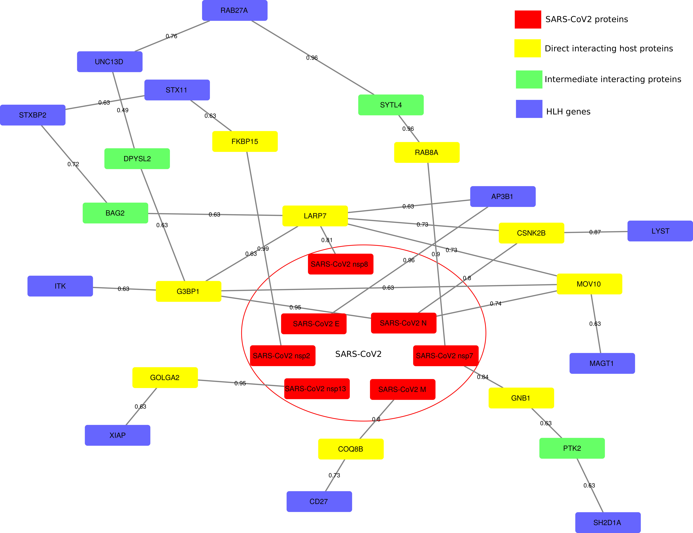

```

 _______  _______  _        _______  _       _________ _______ _________
(  ____ \(  ____ \( (    /|(  ____ \( \      \__   __/(  ____ \\__   __/
| (    \/| (    \/|  \  ( || (    \/| (         ) (   | (    \/   ) (   
| |      | (__    |   \ | || (__    | |         | |   | (_____    | |   
| | ____ |  __)   | (\ \) ||  __)   | |         | |   (_____  )   | |   
| | \_  )| (      | | \   || (      | |         | |         ) |   | |   
| (___) || (____/\| )  \  || (____/\| (____/\___) (___/\____) |   | |   
(_______)(_______/|/    )_)(_______/(_______/\_______/\_______)   )_(   
                                                                        
 _______  _______  _______          _________ ______   __     _____  
/ ___   )(  ____ \(  ___  )|\     /|\__   __/(  __  \ /  \   / ___ \ 
\/   )  || (    \/| (   ) || )   ( |   ) (   | (  \  )\/) ) ( (   ) )
    /   )| |      | |   | || |   | |   | |   | |   ) |  | | ( (___) |
  _/   / | |      | |   | |( (   ) )   | |   | |   | |  | |  \____  |
 /   _/  | |      | |   | | \ \_/ /    | |   | |   ) |  | |       ) |
(   (__/\| (____/\| (___) |  \   /  ___) (___| (__/  )__) (_/\____) )
\_______/(_______/(_______)   \_/   \_______/(______/ \____/\______/ 

 ```                                                                                        


# INTRODUCTION 
<div style="text-align: justify"> 
The outbreak of COVID19 has caused millions of infections globally and reshaped the living of people all over the world fundamentally.  
Tremendous research efforts have been made on understanding the mechanisms of the infection and the spread of the SARS-CoV-2 Virus. 
Recently, a comprehensive interactome map between the SARS-CoV-2 proteins and the host human proteins was published. Such an interactome map provides an unprecedented opportunity for us to study the "connections" of the host human genes/proteins to SARS-CoV-2.   Here, we developed a network-based approach
GeneList2COVID19 to investigate whether a list of genes is "significantly" connected to the SARS-CoV-2 (comparing with all background genes).  
The method can further provide the detailed paths that connect the input genes to the SARS-CoV-2 viral proteins. 
We believe that this tool can provide hints about the potential "connection/association" for any given list of genes, which will facilitate our understanding 
of the roles of host genes in the SARS-CoV-2 viral infection process and thus bring advancement to the drug, vaccine, and other treatment strategies.   
</div>  



# PREREQUISITES

* Python3.6+  
It was installed by default for most Linux distribution and MAC.  
If not, please check [https://www.python.org/downloads/](https://www.python.org/downloads/) for installation 
instructions. 

* Python packages dependencies:  
	-- scipy>=1.4.1  
	--numpy>=1.18.4  
	--matplotlib>=3.2.1  
	--seaborn>=0.10.1  
	--networkx>=2.4  

The python setup.py script (or pip) will try to install these packages automatically.
However, please install them manually if, by any reason, the automatic 
installation fails. 

# INSTALLATION
 
Install from Github (recommended):    
python 3.6+: 

```shell
	$sudo pip3 install --upgrade https://github.com/phoenixding/genelist2covid19/zipball/master
```


The above pip installation options should be working for Linux, Window and MacOS systems.   
  
# USAGE

```shell
usage: GeneList2COVID19.py [-h] -i INPUT_GENES -v VIRAL_HOST_INTERACTIONS -p
                           HOST_PROTEIN_INTERACTIONS -o OUTPUT [-b BACKGROUND]

optional arguments:
  -h, --help            show this help message and exit
  -i INPUT_GENES, --input_genes INPUT_GENES
                        the input gene list for the SARS-CoV-2 association
                        analysis
  -v VIRAL_HOST_INTERACTIONS, --viral_host_interactions VIRAL_HOST_INTERACTIONS
                        The interactions between viral proteins and host
                        proteins
  -p HOST_PROTEIN_INTERACTIONS, --host_protein_interactions HOST_PROTEIN_INTERACTIONS
                        The interaction between host proteins
  -o OUTPUT, --output OUTPUT
                        The specified output directory
  -b BACKGROUND, --background BACKGROUND
                        Integer, the number of background proteins/genes used
                        to calculate the connectivity significance of input
                        genes                        
```

# EXAMPLE
In order to run the program, the following files are essential: 
* (1) -i, Input Gene List:   
Each line represents a gene, only gene symbols are supported. Please convert the gene names first if you have other IDs.   
A example input gene list can be found [example/MarkerGenes.txt](example/MarkerGenes.txt).
* (2) -v, Viral Host Interactions:     
The interaction between the viral proteins and host proteins. 
We have collected the experimentally verified the interactions between SARS-CoV-2 proteins and host proteins in this nature paper [https://www.nature.com/articles/s41586-020-2286-9] from Dr. Krogan's Lab.
You can download it [example/covid19-human_interactions.tsv](example/covid19-human_interactions.tsv)  
If you want to supply your own list of viral host interaction file, please strictly follow the format as the above file (with the same columns). 
* (3) -p Host protein-protein interactions: 
This file specifies the interaction between host proteins. We have collected the Protein-protein interactions (PPI) from HIPPE and BioGRID databases. 
You can download it [example/PPIs.txt](example/PPIs.txt).   
If you want to use a customized PPI file, please strictly follow the format as the above file.  (1st column: interactor A, 2nd column: type. 3rd column: interactor B, 4th column: score [0,1]. )


All all the required files, we can run the software with the following command:    
```shell
GeneList2COVID19 -i example/MarkerGenes.txt -v example/covid19-human_interactions.tsv -p example/PPIs.txt -o example_out
```

# Results
* (1) SPaths.txt   
SARS-CoV2	UNC13D	1.19104358758	['SARS-CoV2 orf3a', 'SUN2', 'LMNA', 'UNC13D']  
This result provides the connectivity score (e.g., 1.19104358758) from the SARS-CoV2 to the target gene. 
It also provides a detailed path: ['SARS-CoV2 orf3a', 'SUN2', 'LMNA', 'UNC13D']    

* (2) Network.sif, NodeInfo.txt  
Network.sif: It's a network file that was supported by Cytoscape. Please refer to [Cytoscape website](https://cytoscape.org/) for instructions about how to load network file.   
NodeInfo.txt: It's attribute file that species the attributes of each node in the network.  Please refer to [Cytoscape website](https://cytoscape.org/) for instructions about how to load the node attribute file.   

* (3) _Connectivity.pdf    
It's the comparison of the "connectivity score" (a smaller score represents a stronger connection)  between input genes and all other genes.  

Please refer to the [example/example_out](example/example_out) for a list of example output files. 

# LICENSE 
 
This software is under MIT license.  
see the LICENSE.txt file for details. 


# CONTACT
jund  at cs.cmu.edu


                                 
                                 
                                 
                                 
                                 

                                                     
